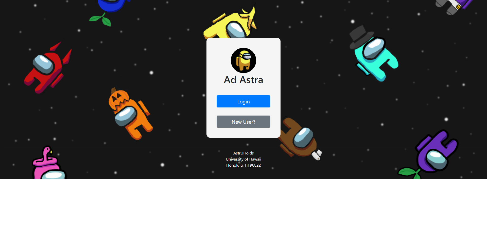
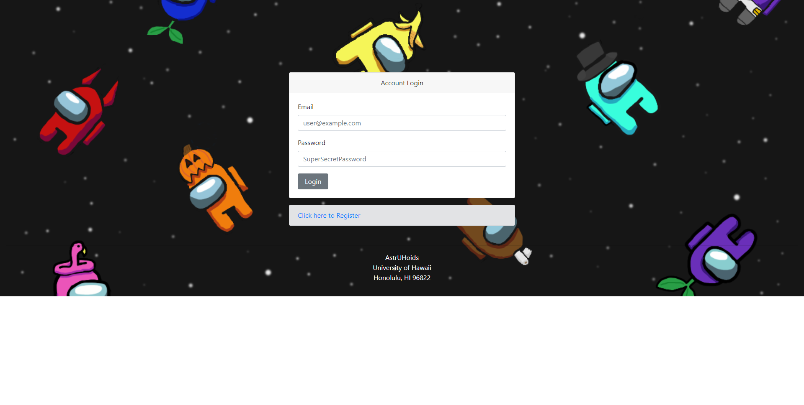
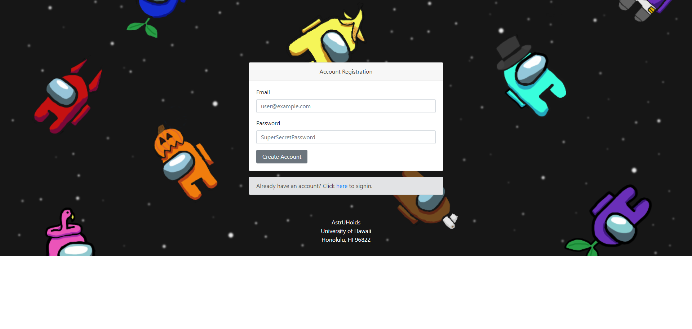
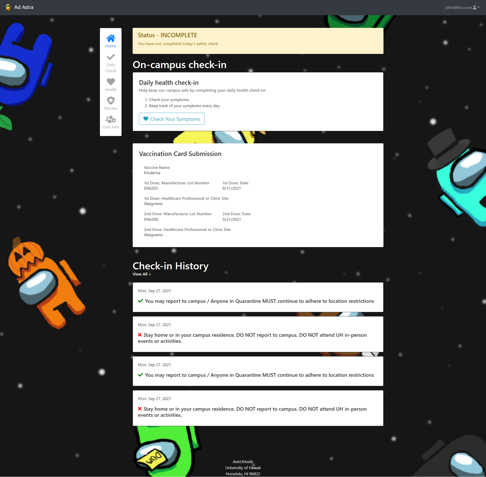
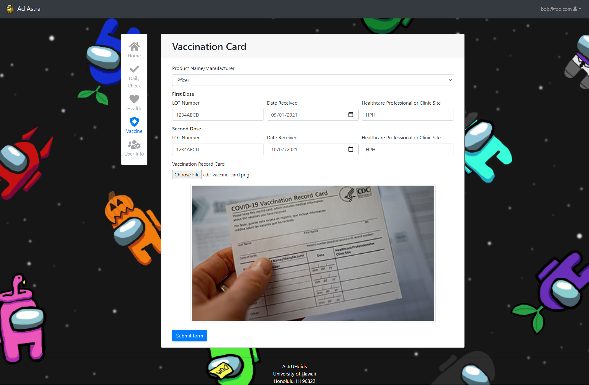

# AstrUHoids - Ad Astra

## Table of contents

  - [Overview](#overview)
  - [Team](#team)
  - [Deployment](#deployment)
  - [User Guide](#user-guide)

## Overview

Our app, Ad Astra allows for UH Campuses to keep track of their ohana's health by providing an application that the users can indicate whether they have symptoms of COVID-19 and if they are allowed to come to campus.

## Team
  - [Deshay Clemons](https://github.com/deshay-clemons)
  - [Luke McDonald](https://github.com/lukemcd9)
  - [Kevin Nguyen](https://github.com/kvndngyn)
  - [Gabriel Undan](https://github.com/gabrielundan)

## Deployment

A live deployment of Ad Astra is available at [https://github.com/astruhoids/ad-astra](https://github.com/astruhoids/ad-astra).

## User Guide

### Landing

This is the landing page that users can either Login or Signup for an account.

### Login

The Login page is where users can log into their accounts.

### Signup

The Signup page is where a new user can sign up for an account to use our app.

### Home

After signing in or signing up and filling out user information, the user is taken to the Home page that has all their information like if they're able to enter the campus, go to the daily check-in form, show their vaccination record if they've input it into our system, and the history of their check-ins.

### User Information

After signing up for our app, we require the user to enter in information about themselves like what is their home campus, if they're currently a UH student, staff, or faculty, if they are staying in on campus housing, and if they're working online throughout the semester. This page can also be navigated to by clicking on the user's username at the top right of the page and clicking "User Information".

### Daily Check

Before a user enters campus they must perform a daily check in to verify that they do not have any symptoms of COVID-19, once they input that they are not having symptoms they will be cleared to come to campus. If they are having symptoms they are not cleared to come to campus.

### Vaccination

A user can upload their vaccine information to our application to keep a digital copy of it and because UH campuses require that individuals who come to campus must be vaccinated.
